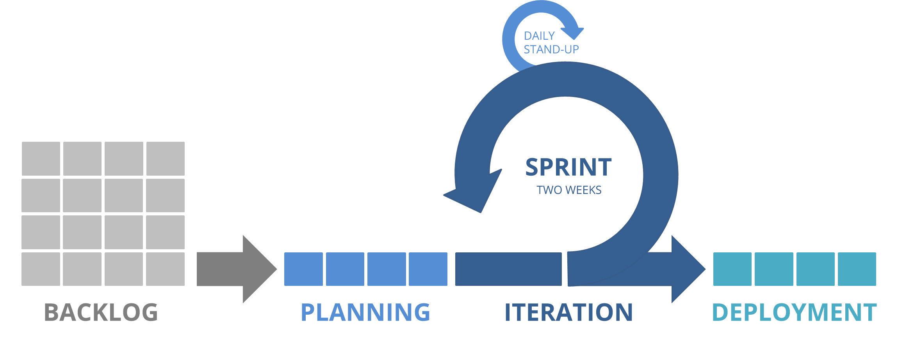

Dev Team: Scrum Process
===

> This is a VERY rough overview of a Development Team Scrum Process.

### Table of Contents

* [**Backlog**](docs/backlog.md)
    * [Creating Tickets](docs/backlog.md#creating-tickets)
    * [Acceptance Criteria](docs/backlog.md#acceptance-criteria)
    * [Emergency Issues](docs/backlog.md#emergency-issues)
* [**Planning**](docs/planning.md)
    * [Grooming](docs/planning.md#grooming)
    * [Estimate](docs/planning.md#estimate)
    * [Retrospective](docs/planning.md#retrospective)
* [**Iteration**](docs/iteration.md)
    * [Sprint Cycle](docs/iteration.md#sprint-cycle)
    * [Daily Standup](docs/iteration.md#daily-standup)
    * [Dev Branches](docs/iteration.md#dev-branches)
    * [Release Branches](docs/iteration.md#release-branches)
    * [Code Review](docs/iteration.md#code-review)
* [**Deployment**](docs/deployment.md)
    * [Continuous Integration](docs/deployment.md#continuous-integration)
    * [Tagged Release](docs/deployment.md#tagged-release)
    * [Post Deployment](docs/deployment.md#post-deployment)
