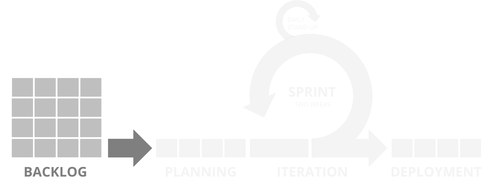

**[↤ BACK](../README.md)**

Backlog
===

> Tickets created from the Product Owner. The Dev Team reviews this list and estimates the level of effort for each. After consulting with the PO, priorities are determined, and sprints created.

#### Table of Contents

* [Creating Tickets](#creating-tickets)
* [Acceptance Criteria](#acceptance-criteria)
* [Sorting Priorities](#sorting-priorities)
* [Emergency Issues](#emergency-issues)

Creating Tickets
---

New tickets are created based on the product owner's needs and should include a detailed description of the product's functional requirements.

A good ticket will give enough detail so that all parties involved in the process will have the information they need to complete the requested task.

While it is tempting to get tickets in as quickly as possible, spending a little more time upfront flushing out details will prevent forced meetings to collect missing information later.

Acceptance Criteria
---

The best way to make sure every ticket is the best it can is to use a consistent template to make everyone's life easier.

The following template contains placeholder text for you to enter your ticket details. It may be tempting to delete sections you don't believe are relevant, but you will more than likely discover that you will need to re-add these sections later during the development process.

 

Sorting Priorities
---

The last real Backlog priority will be keeping tickets organized.  Product Owners will know which tickets are the most important to get out, and which ones might have changed priorities.

Since individual tickets might have the same priority ticket level, the order of the ticket in the Backlog will help the team know where you want them to start.  While adding new tickets into the Backlog, this is the best time to move that new ticket into the correct position in your priorities list.

Emergency Issues
---

Despite our best intentions, things break, and sometimes you will need to deploy a **hotfix** you had not planned on.

**No Need to Panic 😎**

The good news is that this process is flexible.  If the issue cannot wait until the next sprint, we create a new ticket using the same process, but add a few extra steps:

1. Set up a quick **15 Minute** Meeting with a Product Owner, the person reporting the issue and a **single** mid to senior-level developer most familiar with the issue
2. Together, flush out ticket requirements using provided template
3. Have Developer Point ticket with an estimated Level of Effort (LOE)
4. Once LOE is determined, pull up current Sprint Backlog
5. Find ticket(s) of roughly the same LOE that your Product Owner is OK moving to your next sprint ( we need to make room for this hotfix and not pile on new work that will delay deploying )

**PRO TIP:**  Sometimes, there are more hotfixes than your process can handle, and moving tickets to a future sprint might not be realistic.

If you find this becomes an issue for your team, your Scrum Master should allocate additional time in your Sprint purely for hotfixes.  Doing this means you give time for possible emergencies by planning for them.  Honestly not a bad habit of getting into even if you do not experience a regular need for hotfixes 👍🏽