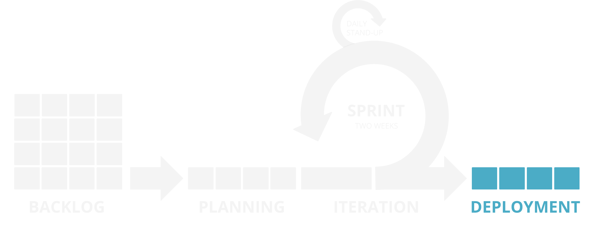

**[↤ BACK](../README.md)**

Deployment
===

> This is the fun part, shipping code 🎉 Once a release is ready to go out, it goes through a deployment process, often using Continuous Integration.

#### Table of Contents

* [Continuous Integration](#continuous-integration)
* [Tagged Release](#tagged-release)
* [Post Deployment](#post-deployment)

Continuous Integration
---

Tagged Release
---

Post Deployment
---
