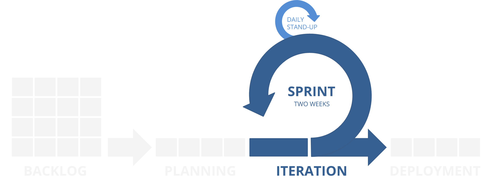

**[↤ BACK](../README.md)**

Iteration
===

> Developers work through groomed tickets assigned to the current Sprint until they are reviewed, approved, and deployed to production.

#### Table of Contents

* [Sprint Cycle](#sprint-cycle)
* [Daily Standup](#daily-standup)
* [Dev Branches](#dev-branches)
* [Release Branches](#release-branches)
* [Code Review](#code-review)

Sprint Cycle
---

Daily Standup
---

Dev Branches
---

Release Branches
---

Code Review
---
