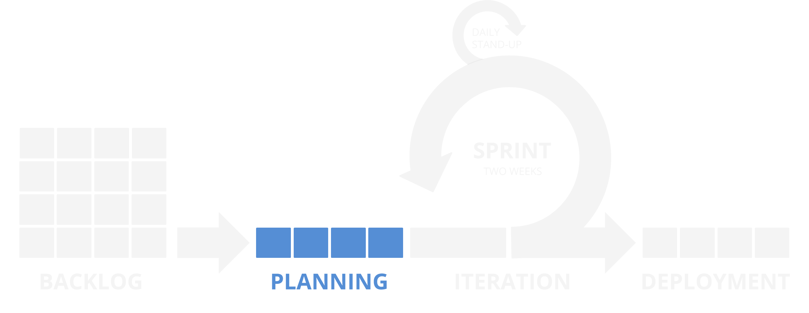

**[↤ BACK](../README.md)**

Planning
===

> The PO, Scrum Master, and Dev Team conduct a sprint planning meeting 60-90 minutes the Friday before starting a new Sprint. The Dev Team votes on a level of effort per ticket and how many tickets they believe that they can complete.

#### Table of Contents

* [Grooming](#grooming)
* [Estimate](#estimate)
* [Retrospective](#retrospective)

Grooming
---

Estimate
---

Retrospective
---
